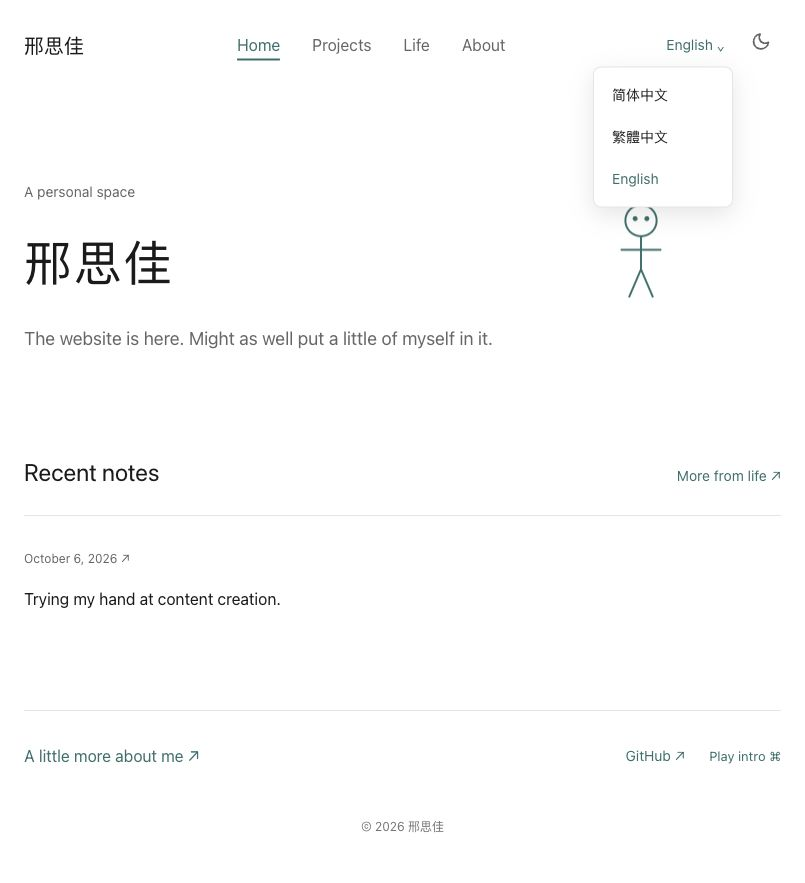

# Personal Space · 个人数字空间

[简体中文](README.md) · [繁體中文](README.zh-TW.md) · [English](README.en.md)

[](https://github.com/Ustinionxxx/personal-space/actions/workflows/check.yml)
[](https://astro.build/)
[](https://nodejs.org/)

邢思佳’s personal website: a place for projects, everyday photos, short notes, and things still in progress.

> The website is here. Might as well put a little of myself in it.

This space can grow slowly. A photo, two sentences, or an unfinished experiment can each have a place here. A small stick figure, open space, and a teal accent leave room for the content to grow at its own pace.

**[Visit the website](https://personal-space-ustinionxxx.pages.dev/en/)** · [Writing and publishing (Chinese)](docs/editor-guide.md) · [Deployment guide (Chinese)](docs/deployment.md)

## Preview

[](https://personal-space-ustinionxxx.pages.dev/en/)

*English homepage preview with the language menu open.*

## What belongs here

| Page | Content |
| --- | --- |
| [Home](https://personal-space-ustinionxxx.pages.dev/en/) | A short introduction, an optional current activity, three recent notes, a featured project, and contact links |
| [Life](https://personal-space-ustinionxxx.pages.dev/en/life) | Short notes and everyday photos, newest first; titles, tags, and photos are optional |
| [Projects](https://personal-space-ustinionxxx.pages.dev/en/work) | Finished projects, work in progress, and experiments that have been set aside |
| [About](https://personal-space-ustinionxxx.pages.dev/en/about) | A freely written introduction, using the same content source as the web editor |

- **Short notes count**: a record needs text or a photo. There is no title, word-count, or achievement requirement.
- **Photos keep their proportions**: JPEG, PNG, WebP, and multi-photo captions are supported. Publishing creates web images and strips EXIF metadata.
- **Links stay stable**: each record has its own ID. Renaming a title does not change its address.
- **A quiet reading experience**: responsive layouts, light and dark themes, keyboard navigation, and reduced motion. The terminal intro plays on request and can be skipped or closed with Esc.
- **Keep it private until it is ready**: the web editor supports private drafts. The website shows published content only.
- **Three languages**: Simplified Chinese keeps the existing URLs; Traditional Chinese and English have their own pages. Switching languages keeps the current record and updates navigation, dates, empty states, and the terminal intro.

Traditional Chinese is converted from the original text at build time. English titles, text, homepage introductions, and photo captions can be entered in the editor’s optional English fields. Missing translations keep the original text with a clear notice. Content is never sent to an external translation service.

## Updating the website

Content is edited through [Pages CMS](https://app.pagescms.org/ustinionxxx/personal-space-content/main). Everyday updates do not require changing code.

1. Sign in with your own GitHub account and open Life records, Projects, About, or Home settings.
2. Write or upload photos, then save as a private draft.
3. When ready, change the status to published and save.
4. Wait for the content repository’s [publishing workflow](https://github.com/Ustinionxxx/personal-space-content/actions/workflows/publish.yml) to succeed, then open the website.

**Saving content and deploying the website are separate steps.** Saving writes files to GitHub. The website changes after its build and deployment finish. See the [editing guide (Chinese)](docs/editor-guide.md) for photos, captions, and withdrawing a record.

## Code and content

This is the same `personal-space` website project. Its current version is on `main`.

| Location | What it stores |
| --- | --- |
| `personal-space` (this public repository) | Astro frontend, components, build scripts, and configuration templates |
| `personal-space-content` (private) | Markdown content, original photos, drafts, and Pages CMS configuration |
| Cloudflare Pages | Built public pages and processed published images |

```text
Edit and save in Pages CMS
        ↓
Private content repository → GitHub Actions (a pinned site-code commit)
        ↓
Select published text and referenced images → Build and check → Cloudflare Pages
```

Drafts, unused photos, original content files, and credentials stay out of public build artifacts. A failed build leaves the previous successful deployment available. Withdrawn content may still exist in old deployments, caches, or someone else’s copies.

See the [deployment guide (Chinese)](docs/deployment.md) for initial setup and updating the pinned code version, and [setup status (Chinese)](docs/setup-status.md) for the current configuration.

## Local development

Use **Node.js 22.12 or later** and npm.

```bash
git clone https://github.com/Ustinionxxx/personal-space.git
cd personal-space
npm ci
npm run dev
```

Open `http://localhost:4321`. Without a private content directory, development uses the confirmed default introduction and empty content pages, so the frontend can be developed independently.

To load your own content repository:

```bash
CONTENT_DIR=../personal-space-content npm run dev
```

Content is generated at startup or build time. Restart the development server after editing content. A production build requires a content directory:

```bash
CONTENT_DIR=../personal-space-content npm run build
npm run preview
```

| Command | Purpose |
| --- | --- |
| `npm run dev` | Start the local development server |
| `npm run check` | Check Astro and TypeScript |
| `npm test` | Verify publication filtering, image processing, stable links, and actual builds |
| `npm run build:empty` | Build empty content pages for public-code checks |
| `npm run build` | Build real content, check types, and audit artifacts; requires `CONTENT_DIR` |
| `npm run preview` | Preview the existing build |

## Project structure

```text
src/
├── components/       Navigation, stick figure, records, and project components
├── layouts/          Page layouts
├── lib/content.ts    Read processed published content
├── lib/i18n.ts       Interface text, dates, and language links
├── pages/            Home, life, projects, and about routes
├── views/            Page views shared by the three languages
└── styles/           Global styles and themes
scripts/              Content processing, builds, artifact checks, and deployment
content-template/     Private repository and Chinese web-editor templates
tests/                Content isolation and build tests
docs/                 Editing guide, deployment guide, and page preview
```

The frontend uses **Astro 7 + TypeScript**, content uses **Markdown**, images are processed by **Sharp**, and Chinese conversion uses **OpenCC**. **Pages CMS** handles editing, and **GitHub Actions + Cloudflare Pages** handle publishing.

## References

This README’s organization draws on:

- [antfu/antfu.me](https://github.com/antfu/antfu.me): a concise introduction with a direct website link.
- [taniarascia/taniarascia.com](https://github.com/taniarascia/taniarascia.com): a clear description of a website made for its author’s personal use.
- [saicaca/fuwari](https://github.com/saicaca/fuwari): the preview, quick start, and command-table structure.
- [lin-stephanie/astro-antfustyle-theme](https://github.com/lin-stephanie/astro-antfustyle-theme): clear features and documentation links.

Structure, layout, and editing workflows can be shared. The words, photos, experiences, and opinions here come from the site’s owner.
