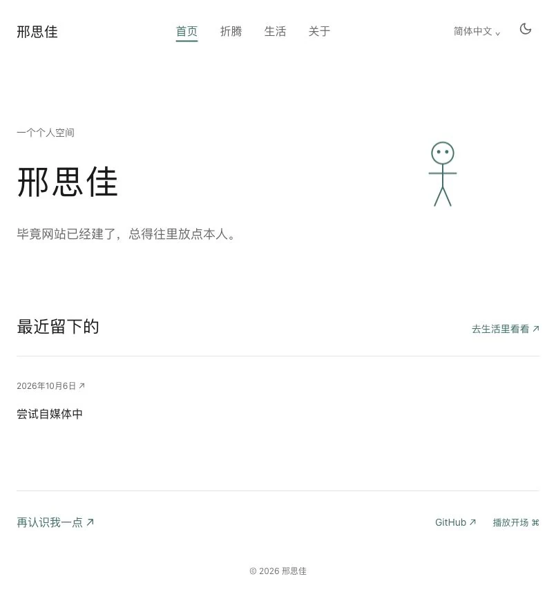

# Personal Space · 个人数字空间

[](https://github.com/Ustinionxxx/personal-space/actions/workflows/check.yml)
[](https://astro.build/)
[](https://nodejs.org/)

邢思佳的个人网站，用来展示作品，也留下生活里的照片、随手记和还在进行的尝试。

> 毕竟网站已经建了，总得往里放点本人。

这个空间可以慢慢长出来。一张照片、两句话、一次没做完的折腾，都可以有自己的位置。页面保留小人、留白和青绿色，让内容按自己的节奏积累。

**[打开网站](https://personal-space-ustinionxxx.pages.dev/)** · [写字与发布](docs/editor-guide.md) · [部署说明](docs/deployment.md)

## 页面预览

[](https://personal-space-ustinionxxx.pages.dev/)

*当前线上首页的暗色主题。*

## 可以留下什么

| 页面 | 内容 |
| --- | --- |
| [首页](https://personal-space-ustinionxxx.pages.dev/) | 简短介绍、可选的“最近在……”、最近三条记录、选中的项目与联系入口 |
| [生活](https://personal-space-ustinionxxx.pages.dev/life) | 随手记和生活照片，按记录日期倒序排列；标题、标签和照片都可选 |
| [折腾](https://personal-space-ustinionxxx.pages.dev/work) | 做过或正在做的项目，也可以记录暂时搁置的尝试 |
| [关于](https://personal-space-ustinionxxx.pages.dev/about) | 自由书写的个人介绍，与网页后台使用同一份内容源 |

- **写得短也能发布**：正文或照片至少有一项，不要求标题、字数或成果。
- **照片完整展示**：支持 JPEG、PNG、WebP 与多图说明，横竖照片保留比例；发布时生成网页图片并去除 EXIF。
- **链接保持稳定**：记录使用独立 ID，修改标题不会改变原来的地址。
- **读起来轻一点**：支持手机布局、亮暗主题、键盘导航与减少动画设置；终端开场可以主动播放、跳过或按 Esc 关闭。
- **先留给自己，再决定公开**：网页后台支持私密草稿，网站只展示已发布内容。

## 日常更新

内容通过 [Pages CMS 网页后台](https://app.pagescms.org/ustinionxxx/personal-space-content/main) 编辑，日常更新不用修改代码。

1. 使用自己的 GitHub 账号登录，进入「生活记录」「项目」「个人介绍」或「首页设置」。
2. 写文字或上传照片，先以「私密草稿」保存。
3. 准备公开时，改成「已发布」并保存。
4. 等待内容仓库的 [自动发布任务](https://github.com/Ustinionxxx/personal-space-content/actions/workflows/publish.yml) 成功，再打开网站查看。

**后台保存成功与网站部署成功是两个步骤。** 保存把内容写入 GitHub；构建和部署完成后，网站才会更新。详细操作、图片说明和撤回方法见 [编辑指南](docs/editor-guide.md)。

## 代码与内容

这是同一个 `personal-space` 网站项目，`main` 保存当前正式版本。

| 位置 | 保存什么 |
| --- | --- |
| `personal-space`（本仓库，公开） | Astro 前台、组件、构建脚本和配置模板 |
| `personal-space-content`（私有） | Markdown 内容、原始照片、草稿与 Pages CMS 配置 |
| Cloudflare Pages | 构建后的公开网页与处理后的已发布图片 |

```text
Pages CMS 编辑与保存
        ↓
私有内容仓库 → GitHub Actions（读取固定提交的站点代码）
        ↓
筛选已发布文字与实际引用的图片 → 构建并检查 → Cloudflare Pages
```

草稿、未引用的照片、原始内容文件和凭据不进入公开产物。构建失败时保留上一次成功部署的网站。已经公开过的内容即使撤回，也可能留在历史部署、缓存或他人的副本中。

首次配置和更新站点代码版本的方法见 [部署说明](docs/deployment.md)，当前接入信息见 [接入状态](docs/setup-status.md)。

## 本地开发

需要 **Node.js 22.12 或更高版本**，使用 npm 安装依赖。

```bash
git clone https://github.com/Ustinionxxx/personal-space.git
cd personal-space
npm ci
npm run dev
```

打开 `http://localhost:4321`。未指定私有内容目录时，开发服务器使用已确认的默认介绍与空内容页，方便独立调整前台。

要在本地读取自己的内容仓库：

```bash
CONTENT_DIR=../personal-space-content npm run dev
```

内容在启动或构建时生成，修改内容后需重新启动开发服务器。生产构建必须指定内容目录：

```bash
CONTENT_DIR=../personal-space-content npm run build
npm run preview
```

| 命令 | 用途 |
| --- | --- |
| `npm run dev` | 启动本地开发服务器 |
| `npm run check` | 检查 Astro 与 TypeScript |
| `npm test` | 验证内容筛选、图片处理、固定链接与实际构建 |
| `npm run build:empty` | 构建空内容版本，用于公开代码检查 |
| `npm run build` | 构建真实内容，执行类型检查与产物检查；需设置 `CONTENT_DIR` |
| `npm run preview` | 预览已生成的构建结果 |

## 项目结构

```text
src/
├── components/       导航、小人、图文记录与项目组件
├── layouts/          页面布局
├── lib/content.ts    读取处理后的已发布内容
├── pages/            首页、生活、折腾与关于
└── styles/           全局样式与主题
scripts/              内容处理、构建、产物检查与部署
content-template/     私有内容仓库与中文后台配置模板
tests/                内容隔离及构建测试
docs/                 编辑指南、部署说明与页面预览
```

前台使用 **Astro 7 + TypeScript**，内容使用 **Markdown**，图片由 **Sharp** 处理；网页编辑使用 **Pages CMS**，自动发布使用 **GitHub Actions + Cloudflare Pages**。

## 参考与借鉴

本次 README 的组织方式参考了这些项目：

- [antfu/antfu.me](https://github.com/antfu/antfu.me)：简洁的个人网站介绍和直接的网站入口。
- [taniarascia/taniarascia.com](https://github.com/taniarascia/taniarascia.com)：说明这是为自己使用而制作的个人网站。
- [saicaca/fuwari](https://github.com/saicaca/fuwari)：页面预览、快速开始与命令表的组织方式。
- [lin-stephanie/astro-antfustyle-theme](https://github.com/lin-stephanie/astro-antfustyle-theme)：功能说明与使用文档的清晰入口。

借鉴结构、排版和编辑流程，文字、照片、经历和观点由本人提供。这里留下的内容，应当是自己的。
