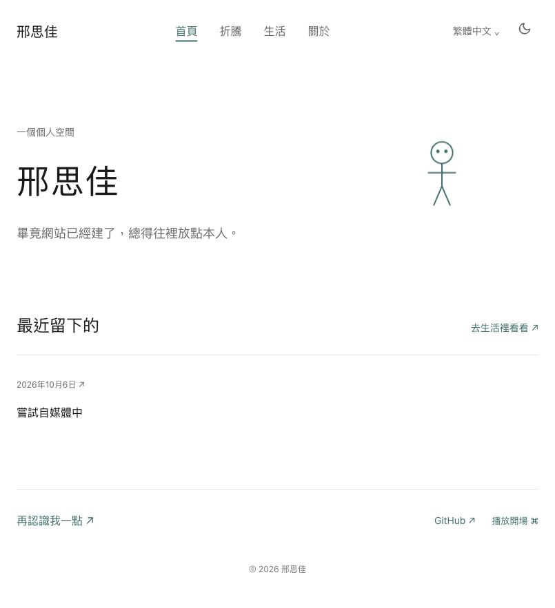

# Personal Space · 個人數字空間

[简体中文](README.md) · [繁體中文](README.zh-TW.md) · [English](README.en.md)

[](https://github.com/Ustinionxxx/personal-space/actions/workflows/check.yml)
[](https://astro.build/)
[](https://nodejs.org/)

邢思佳的個人網站，用來展示作品，也留下生活裡的照片、隨手記和還在進行的嘗試。

> 畢竟網站已經建了，總得往裡放點本人。

這個空間可以慢慢長出來。一張照片、兩句話、一次沒做完的折騰，都可以有自己的位置。頁面保留小人、留白和青綠色，讓內容按自己的節奏積累。

**[打開網站](https://personal-space-ustinionxxx.pages.dev/)** · [寫字與發佈](docs/editor-guide.md) · [部署說明](docs/deployment.md)

## 頁面預覽

[](https://personal-space-ustinionxxx.pages.dev/)

*繁體首頁預覽，包含新的語言切換入口。*

## 可以留下什麼

| 頁面 | 內容 |
| --- | --- |
| [首頁](https://personal-space-ustinionxxx.pages.dev/) | 簡短介紹、可選的“最近在……”、最近三條記錄、選中的項目與聯繫入口 |
| [生活](https://personal-space-ustinionxxx.pages.dev/life) | 隨手記和生活照片，按記錄日期倒序排列；標題、標籤和照片都可選 |
| [折騰](https://personal-space-ustinionxxx.pages.dev/work) | 做過或正在做的項目，也可以記錄暫時擱置的嘗試 |
| [關於](https://personal-space-ustinionxxx.pages.dev/about) | 自由書寫的個人介紹，與網頁後臺使用同一份內容源 |

- **寫得短也能發佈**：正文或照片至少有一項，不要求標題、字數或成果。
- **照片完整展示**：支持 JPEG、PNG、WebP 與多圖說明，橫豎照片保留比例；發佈時生成網頁圖片並去除 EXIF。
- **鏈接保持穩定**：記錄使用獨立 ID，修改標題不會改變原來的地址。
- **讀起來輕一點**：支持手機佈局、亮暗主題、鍵盤導航與減少動畫設置；終端開場可以主動播放、跳過或按 Esc 關閉。
- **先留給自己，再決定公開**：網頁後臺支持私密草稿，網站只展示已發佈內容。
- **三種語言**：簡體中文保留原鏈接，繁體中文與 English 使用獨立頁面；切換時保留當前記錄，導航、日期、空頁面提示和終端彩蛋隨語言變化。

繁體內容由簡體原文在構建時轉換。英語正文、標題、首頁介紹和照片說明可在後臺的 English 字段中填寫；留空仍可正常發佈，英語頁面會保留原文並標註。不會把內容發送給外部翻譯服務。

## 日常更新

內容通過 [Pages CMS 網頁後臺](https://app.pagescms.org/ustinionxxx/personal-space-content/main) 編輯，日常更新不用修改代碼。

1. 使用自己的 GitHub 賬號登錄，進入「生活記錄」「項目」「個人介紹」或「首頁設置」。
2. 寫文字或上傳照片，先以「私密草稿」保存。
3. 準備公開時，改成「已發佈」並保存。
4. 等待內容倉庫的 [自動發佈任務](https://github.com/Ustinionxxx/personal-space-content/actions/workflows/publish.yml) 成功，再打開網站查看。

**後臺保存成功與網站部署成功是兩個步驟。** 保存把內容寫入 GitHub；構建和部署完成後，網站才會更新。詳細操作、圖片說明和撤回方法見 [編輯指南](docs/editor-guide.md)。

## 代碼與內容

這是同一個 `personal-space` 網站項目，`main` 保存當前正式版本。

| 位置 | 保存什麼 |
| --- | --- |
| `personal-space`（本倉庫，公開） | Astro 前臺、組件、構建腳本和配置模板 |
| `personal-space-content`（私有） | Markdown 內容、原始照片、草稿與 Pages CMS 配置 |
| Cloudflare Pages | 構建後的公開網頁與處理後的已發佈圖片 |

```text
Pages CMS 編輯與保存
        ↓
私有內容倉庫 → GitHub Actions（讀取固定提交的站點代碼）
        ↓
篩選已發佈文字與實際引用的圖片 → 構建並檢查 → Cloudflare Pages
```

草稿、未引用的照片、原始內容文件和憑據不進入公開產物。構建失敗時保留上一次成功部署的網站。已經公開過的內容即使撤回，也可能留在歷史部署、緩存或他人的副本中。

首次配置和更新站點代碼版本的方法見 [部署說明](docs/deployment.md)，當前接入信息見 [接入狀態](docs/setup-status.md)。

## 本地開發

需要 **Node.js 22.12 或更高版本**，使用 npm 安裝依賴。

```bash
git clone https://github.com/Ustinionxxx/personal-space.git
cd personal-space
npm ci
npm run dev
```

打開 `http://localhost:4321`。未指定私有內容目錄時，開發服務器使用已確認的默認介紹與空內容頁，方便獨立調整前臺。

要在本地讀取自己的內容倉庫：

```bash
CONTENT_DIR=../personal-space-content npm run dev
```

內容在啟動或構建時生成，修改內容後需重新啟動開發服務器。生產構建必須指定內容目錄：

```bash
CONTENT_DIR=../personal-space-content npm run build
npm run preview
```

| 命令 | 用途 |
| --- | --- |
| `npm run dev` | 啟動本地開發服務器 |
| `npm run check` | 檢查 Astro 與 TypeScript |
| `npm test` | 驗證內容篩選、圖片處理、固定鏈接與實際構建 |
| `npm run build:empty` | 構建空內容版本，用於公開代碼檢查 |
| `npm run build` | 構建真實內容，執行類型檢查與產物檢查；需設置 `CONTENT_DIR` |
| `npm run preview` | 預覽已生成的構建結果 |

## 項目結構

```text
src/
├── components/       導航、小人、圖文記錄與項目組件
├── layouts/          頁面佈局
├── lib/content.ts    讀取處理後的已發佈內容
├── lib/i18n.ts       界面文案、日期與語言鏈接
├── pages/            首頁、生活、折騰與關於
├── views/            三種語言共用的頁面視圖
└── styles/           全局樣式與主題
scripts/              內容處理、構建、產物檢查與部署
content-template/     私有內容倉庫與中文後臺配置模板
tests/                內容隔離及構建測試
docs/                 編輯指南、部署說明與頁面預覽
```

前臺使用 **Astro 7 + TypeScript**，內容使用 **Markdown**，圖片由 **Sharp** 處理，繁簡轉換使用 **OpenCC**；網頁編輯使用 **Pages CMS**，自動發佈使用 **GitHub Actions + Cloudflare Pages**。

## 參考與借鑑

本次 README 的組織方式參考了這些項目：

- [antfu/antfu.me](https://github.com/antfu/antfu.me)：簡潔的個人網站介紹和直接的網站入口。
- [taniarascia/taniarascia.com](https://github.com/taniarascia/taniarascia.com)：說明這是為自己使用而製作的個人網站。
- [saicaca/fuwari](https://github.com/saicaca/fuwari)：頁面預覽、快速開始與命令表的組織方式。
- [lin-stephanie/astro-antfustyle-theme](https://github.com/lin-stephanie/astro-antfustyle-theme)：功能說明與使用文檔的清晰入口。

借鑑結構、排版和編輯流程，文字、照片、經歷和觀點由本人提供。這裡留下的內容，應當是自己的。
